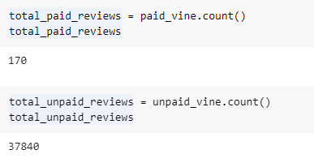
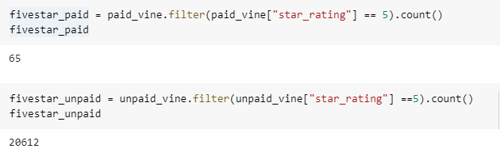
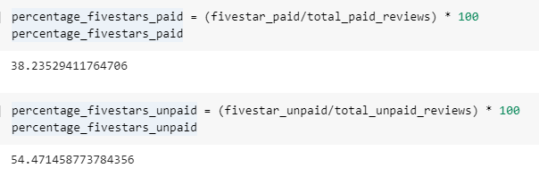

# Amazon Vine Analysis

## Overview of the Analysis
The purpose of this analysis is to determine if there is a bias for favorable reviews from paid vine members. This project analysed an Amazon review dataset for pet products using pySpark and the ETL method.

## Results
This analysis has found the following results:
- The total of Vine reviews and Non-Vine review were 170 and 37,830.

- Total 5 star vine reviews are 65. And the total 5 star nonvine reviews are 20,612.

- What percentage of Vine reviews were 5 stars? What percentage of non-Vine reviews were 5 stars? The percentage of Vine reviews is 38.2%, and percentage for non-Vine reviews is 54.4%.

## Summary
According to this analysis, 5 star Vine reviews are slightly over 50% of the total 5 star reviews, compared to 5 star paid Vine reviews at a percentage of 38% of total 5 star reviews. Ultimately, a favorable bias toward paid Vine program member reviews is not indicated. 

There is an unbalance total in total Vine reviews (170) to non-Vine reviews (37,830) and total five star Vine reviews (65) to total five star non-Vine reviews (20,612). Comparing these figures could lead to a misrepresentation in the data analysis.